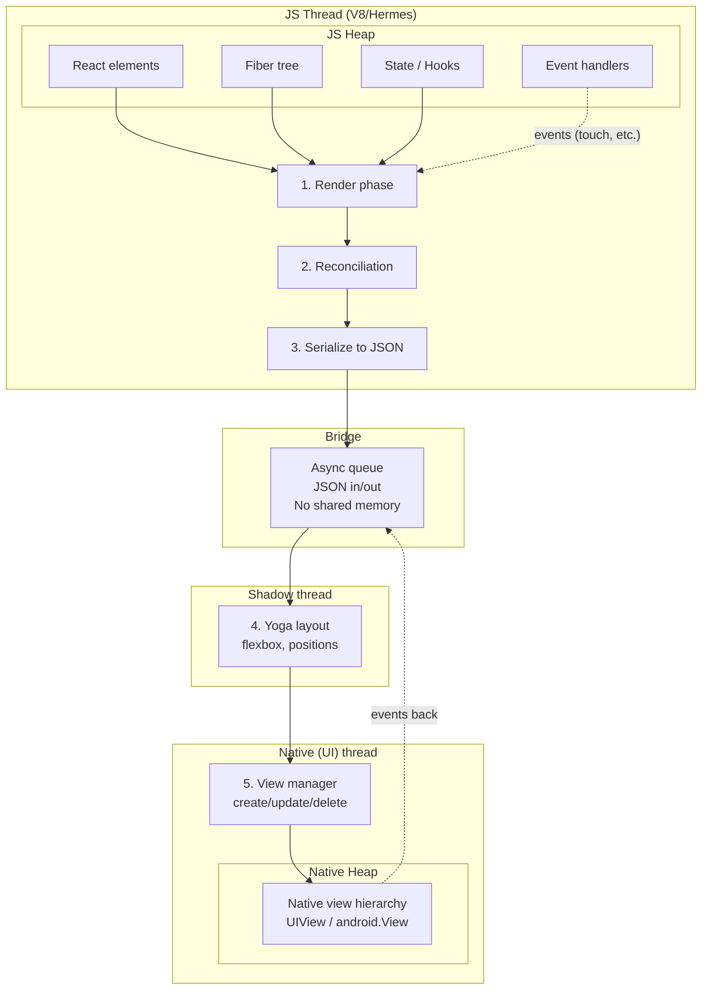

# React Native – Old Architecture: Full Flow (Re-render / Screen Mount)

## Mermaid diagram (render in GitHub / Mermaid viewer)



## What exactly happens in the bridge?

**Important:** The JS bundle is **not** sent over the bridge. The bundle is loaded **once at app startup** and runs entirely in the JS engine. The bridge is only for **runtime messages** between JS and native.

### What the bridge actually carries

- **Not:** JS heap objects, fibers, component instances, or “memory locations.”
- **Yes:** **Serialized instructions** (batched as JSON-like messages), for example:
  - `createView(tag, viewName, props)` — “create a native view of type `RCTView` / `TextView` with these props”
  - `updateView(tag, props)` — “update the native view with this tag”
  - `manageChildren(tag, moveFrom, moveTo, addTags, removeTags)` — “change children of this view”
  - `setChildren(tag, childTags)`
  - And similar batched layout + view updates.

So JS sends **descriptions** (“create a view with this type and these props”), not pointers or raw memory.

### Do JS memory locations become native memory locations?

**No.** JS heap and native heap are **completely separate**. There is no shared memory in the old architecture.

| Side   | What exists in memory |
|--------|------------------------|
| **JS** | Fibers, component state, element tree, the **instructions** (effect list) that get serialized. |
| **Bridge** | A **copy** of the serialized message (e.g. JSON). Once consumed, it’s just a queue. |
| **Native** | Native allocates **new** memory when it receives a message. It creates `UIView` / `android.View` etc. from the **description** in the message. |

So when JS says “create view tag 42, type `RCTView`, props `{ style: { width: 100 } }`”:

1. JS builds that **message** from its fiber/effect list (using JS memory).
2. The message is **serialized** (e.g. to JSON) and a **copy** is put on the bridge.
3. The native side reads the message and **allocates native memory** for a new view, then configures it from the props. That native view lives in the **native heap** only.

The only “link” between the two worlds is a **tag** (a number): both sides agree “tag 42 = this view,” but the actual memory is separate — no JS memory address becomes a native memory address.

### One-way flow (conceptually)

```
JS heap (fiber tree, state)
    → build effect list (createView/updateView/…)
    → serialize to JSON
    → bridge (queue of message copies)
    → native reads message
    → native allocates its own memory and creates/updates views
```

So: **JS is not “bundled and sent” over the bridge.** Only **instructions** are sent; native creates **new** native memory from those instructions. No JS memory location is reused as native memory.

```
┌─────────────────────────────────────────────────────────────────────────────────┐
│                           JAVASCRIPT THREAD (V8/Hermes)                           │
├─────────────────────────────────────────────────────────────────────────────────┤
│                                                                                  │
│   JS HEAP (memory)                                                               │
│   ┌──────────────┐  ┌──────────────┐  ┌──────────────┐  ┌──────────────┐      │
│   │ React        │  │ Fiber tree    │  │ Component    │  │ Event        │      │
│   │ elements     │  │ (current +    │  │ state,       │  │ handlers,    │      │
│   │ (virtual     │  │  work-in-     │  │ hooks        │  │ closures     │      │
│   │  tree)       │  │  progress)    │  │              │  │              │      │
│   └──────┬───────┘  └──────┬───────┘  └──────┬───────┘  └──────┬───────┘      │
│          │                 │                 │                 │               │
│          │    ┌────────────┴────────────┐    │                 │               │
│          │    │ 1. RENDER PHASE          │    │                 │               │
│          │    │    Component runs       │◄───┘                 │               │
│          │    │    → new element tree   │                       │               │
│          │    │    → new fiber tree     │                       │               │
│          │    └────────────┬────────────┘    │                   │               │
│          │                 │                │                   │               │
│          │    ┌────────────┴────────────┐    │                   │               │
│          │    │ 2. RECONCILIATION       │    │                   │               │
│          │    │    Diff old vs new      │    │                   │               │
│          │    │    fiber tree          │    │                   │               │
│          │    │    → effect list        │    │                   │               │
│          │    │    (create/update/del) │    │                   │               │
│          │    └────────────┬────────────┘    │                   │               │
│          │                 │                │                   │               │
│          │    ┌────────────┴────────────┐    │                   │               │
│          │    │ 3. SERIALIZE           │    │                   │               │
│          │    │    Effect list + tree  │    │                   │               │
│          │    │    → JSON payload      │    │                   │               │
│          │    └────────────┬────────────┘    │                   │               │
│          │                 │                │                   │               │
└──────────┼─────────────────┼────────────────┼─────────────────┼───────────────┘
           │                 │                │                   │
           │                 ▼                │                   │
           │    ┌─────────────────────────────┐                   │
           │    │         BRIDGE               │  async, batched   │
           │    │  (JSON in / JSON out)       │  queue            │
           │    │  • No shared memory         │                   │
           │    │  • Copy + serialize         │                   │
           │    └────────────┬────────────────┘                   │
           │                 │                                     │
           │                 │  payload to native                  │
           │                 ▼                                     │
┌──────────┼─────────────────┼───────────────────────────────────────────────────┐
│          │     SHADOW THREAD │                                                    │
│          │                  ▼                                                    │
│          │     ┌────────────────────────────┐                                    │
│          │     │ 4. YOGA (layout)            │  C++ layout engine                 │
│          │     │    Compute positions,      │  (flexbox)                         │
│          │     │    sizes for each node     │                                    │
│          │     │    → layout tree           │                                    │
│          │     └────────────┬───────────────┘                                    │
│          │                  │                                                    │
│          │                  │  layout results (often back over bridge to JS      │
│          │                  │  if JS needs them → async!)                        │
│          │                  ▼                                                    │
├──────────┼──────────────────┼───────────────────────────────────────────────────┤
│          │     NATIVE (UI)   │    THREAD                                          │
│          │                  ▼                                                    │
│          │     ┌────────────────────────────┐                                    │
│          │     │ 5. VIEW MANAGER            │                                    │
│          │     │    Create / update /       │  NATIVE HEAP (memory)              │
│          │     │    delete native views     │  ┌─────────────────────────────┐   │
│          │     │    (UIView, View, etc.)   │──│► Native view hierarchy       │   │
│          │     └────────────────────────────┘  │ (UIView, android.View)     │   │
│          │                                      │ Layout rects, props        │   │
│          │                                      └─────────────────────────────┘   │
│          │                                                                         │
│   Event  │  ◄── Touch, layout events go back to JS over BRIDGE (async)              │
│   (e.g.  │                                                                         │
│   touch) └───────────────────────────────────────────────────────────────────────┘
│
└───────────────────────────────────────────────────────────────────────────────────┘
```

## What happens in each case

### A. Re-render (e.g. setState on same screen)

1. **JS:** Event or setState → scheduler marks fiber(s) dirty.
2. **JS:** Render phase runs (component functions, hooks) → new element tree, new fiber tree.
3. **JS:** Reconciliation (diff) → effect list (update props, update text, etc.).
4. **JS:** Effect list + tree serialized to JSON → sent over **bridge**.
5. **Bridge:** Message queued, passed to native side (async).
6. **Shadow:** Yoga runs on the updated tree → new layout.
7. **Native:** View manager applies updates (e.g. update View props, text) → **native view hierarchy** updated in **native memory**.
8. **Result:** Screen shows new state; all cross-boundary work went through the bridge (serialize/deserialize).

### B. New screen mounts (e.g. navigate to Search)

1. **JS:** Navigator state changes → new subtree (e.g. SearchScreen) gets mounted.
2. **JS:** Render phase runs for the new subtree → new fibers and elements for SearchScreen and its children.
3. **JS:** Reconciliation → effect list: **create** new nodes (many new views).
4. **JS:** Large payload (whole new tree) serialized → sent over **bridge**.
5. **Bridge:** Bigger message, possible batch; still async.
6. **Shadow:** Yoga runs on full new subtree → layout for all new views.
7. **Native:** View manager **creates** new native views (e.g. TextInput, View) and attaches to the native view hierarchy → **native memory** allocates for new views.
8. **Result:** New screen is visible; JS heap has new fibers/state for SearchScreen; native heap has new UIView/android.View instances.

## Memory summary

| Location   | Holds |
|-----------|--------|
| **JS heap** | React elements, fiber tree, component state, hooks, closures, serialized payloads (temporarily). |
| **Bridge**  | Queued messages (serialized JSON); no shared memory with JS or native. |
| **Native heap** | Native view hierarchy (UIView, android.View), layout results, view props. |

## Takeaways

- **Re-render:** Same flow every time: render → reconcile → serialize → bridge → shadow (layout) → native (update/create views). No synchronous read from native in the old arch.
- **New screen:** Same pipeline with a **larger** tree and more **create** effects → more bridge traffic and more native allocations.
- **Bottleneck:** Bridge (async + serialization) and the fact that any “read from native” (e.g. measure) must go bridge → native → bridge → JS, so it’s always async and slower than the new architecture (JSI + Fabric).

---

# New Architecture: What Changed & Memory Perspective

## What replaced what

| Old architecture        | New architecture   | Role |
|-------------------------|--------------------|------|
| **Bridge** (async, JSON) | **JSI** (JavaScript Interface) | JS ↔ native communication |
| **Paper** (UIManager + shadow in native, driven by bridge) | **Fabric** | Rendering: shadow tree + view updates |
| **NativeModules** (eager, bridge) | **TurboModules** | Native APIs (lazy, JSI) |

---

## 1. JSI (JavaScript Interface)

**What it is:** A C++ layer that the JS engine (Hermes) can call into directly. No JSON queue in between.

- **Old (bridge):** JS → serialize to JSON → queue → native deserializes → native runs. Async only; no return value in the same turn.
- **New (JSI):** JS holds a **reference** to a C++ object (a *HostObject*). When JS calls a method on it, the call goes **synchronously** into C++. So JS can call `someNativeObject.measure()` and get a result back in the same call stack.

**Memory perspective:**

- **Old:** Every cross-boundary call copied data (serialize → queue → deserialize). No shared memory; only message copies.
- **New:** No serialization for JSI calls. C++ can expose *wrappers* to JS; JS holds a reference (not a copy of the native object). The actual native data still lives in C++/native heap — we don’t “share one heap,” but we **don’t copy** the payload for every call. So: **less allocation, less GC pressure** on the JS side, and **synchronous** reads (e.g. measure) without extra round-trips.

---

## 2. Fabric (new renderer)

**What it is:** The new rendering pipeline. The **shadow tree** (the tree that Yoga lays out) lives in **C++**, not in native (Android/iOS) view land. Fabric is the owner of that tree and drives layout and view creation/updates.

**Flow (conceptually):**

1. **JS:** React still runs render + reconciliation and produces an **update payload** (what changed).
2. **JSI:** That payload is passed to Fabric **synchronously** (no bridge queue). It’s not “serialize entire tree to JSON”; it’s structured data (often C++ types or a compact representation) that C++ can consume directly.
3. **C++ (Fabric):** Holds the **shadow tree**. Applies the update to the shadow tree, runs **Yoga** in C++, gets layout.
4. **C++ → native:** Fabric then tells the **native view layer** to create/update/delete views. So the “view manager” step is still there, but it’s driven from C++ with already-computed layout, not from JS over the bridge.

**Memory perspective:**

| Aspect | Old (bridge + Paper) | New (Fabric) |
|--------|----------------------|--------------|
| **Where the shadow tree lives** | Effectively re-built from batched bridge messages on the native side; layout on native thread. | **C++** (Fabric). Single authoritative tree. |
| **What crosses the boundary** | Full tree or large batches **serialized to JSON** (big copies). | **Update payloads** (diffs / incremental) passed via JSI; C++ mutates its own tree. No JSON. |
| **Allocation** | JS: big serialized strings. Native: parse and allocate. | Much less: no big JSON strings; C++ holds and updates its own structures. |
| **Layout** | Yoga could run on native side, but tree had to be built from bridge messages first. | Yoga runs in C++ on Fabric’s shadow tree; no round-trip through JS. |
| **Synchronous layout/measure** | Not possible from JS (bridge is async). | Possible: JS can call into Fabric via JSI and get layout/measure **synchronously** (e.g. for layout-in-JS or scroll metrics). |

So from a **memory** point of view: **no more large serialized tree copies** over the boundary; the “source of truth” for the UI tree is in **C++**, and JS sends small updates. That means **less JS and native allocation** and **less GC** for the same UI changes.

---

## 3. TurboModules

**What it is:** Native modules (e.g. Bluetooth, sensors) are no longer eagerly initialized at startup. They’re **lazy**: loaded when first used. The API is exposed to JS via **JSI** (HostObjects), not the bridge.

**Memory perspective:**

- **Old:** All native modules initialized at startup → more **native memory** and startup work, even for modules the app never uses.
- **New:** Only the modules you actually call get loaded → **lower baseline native memory** and **faster startup**. When you do call one, there’s no bridge serialization, so again **less allocation** and **synchronous** calls if needed.

---

## Side-by-side: where things live in memory

| | Old architecture | New architecture |
|--|------------------|------------------|
| **JS heap** | Elements, fibers, state, **serialized payloads** (temporary, can be large). | Elements, fibers, state; **small update payloads** or JSI references; no big JSON blobs. |
| **“Bridge”** | **Queue of serialized messages** (copies of tree/updates). | **Gone.** Replaced by direct JSI calls (no queue of serialized UI tree). |
| **C++ / Fabric** | Not the owner of the shadow tree in the same way. | **Shadow tree + Yoga** live here; single place for layout and diff. |
| **Native heap** | View hierarchy (UIView / android.View); built from bridge messages. | View hierarchy; **driven by Fabric** from C++, not from JS over the bridge. |

---

## Summary: what changed from a memory perspective

1. **No bridge queue:** No large JSON copies of the tree or batches → **less allocation**, **less GC**, and **synchronous** JS ↔ native when needed.
2. **Shadow tree in C++:** One authoritative tree in Fabric; updates are **incremental** over JSI, not “full tree over bridge” → **less data crossing the boundary** and **less redundant work**.
3. **JSI references:** JS can hold references to C++/native-backed objects and call them **synchronously** → no extra copies for each call; **measure/layout** can be synchronous.
4. **TurboModules:** Lazy native modules → **lower native memory** at startup and **no bridge** for module calls.

So in the new architecture: **JS heap** and **native heap** are still **separate** (we don’t merge them into one). The big difference is **how** they talk: no serialization queue, no big copies, and the **shadow tree and layout live in C++**, so the same re-render or screen mount does **less work** and uses **less memory** than in the old architecture.
